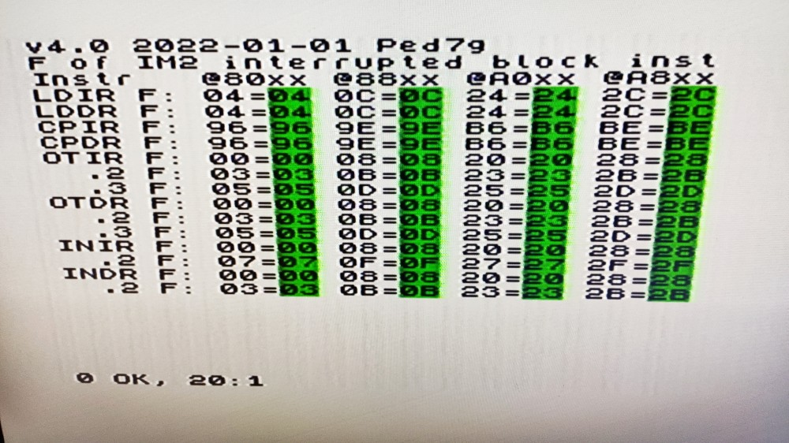

# Z80 Block Flags Test

## About

This test for the [ZX Spectrum](https://en.wikipedia.org/wiki/ZX_Spectrum) checks the flags of the [Zilog Z80 CPU](https://en.wikipedia.org/wiki/Zilog_Z80) after executing block instructions, which [David Banks](https://github.com/hoglet67) [found](https://stardot.org.uk/forums/viewtopic.php?p=212021#p212021) to [behave differently](https://github.com/hoglet67/Z80Decoder/wiki/Undocumented-Flags) to what was previously [documented](http://www.z80.info/zip/z80-documented.pdf) by Sean Young, when those instructions are repeated and interrupted before counter will reach zero. Big thank-you to these gentlemen for their research and documentation.

Extra thanks to ZjoyKiLer for testing the test while I was developing it and various support.

## Expected behaviour

These rules apply only in case the block instruction was already executed at least once, the counter is non-zero (the CPU plans to execute the same instruction again) and instead the interrupt is serviced, so PC points back at the ED byte of the block instruction and flags are set by the extra machine cycle servicing the repeating of instruction and reverting PC back. After return from interrupt handler the block instruction will resume and continue until counter is zero.

In such case, LDxR and CPxR instruction have flags set as LDx/CPx, but bit 5 (YF) is equal to PC.13 and bit 3 (XF) is equal to PC.11.

INxR / OTxR do also modify YF/XF with PC.13/PC.11, but also further modify PF and HF (on top of the flag modifications caused already by the INx / OUTx sub-instruction-part already executed), see source code with larger comment describing calculation of PF/HF in such case.

It's possible the behaviour will be different for different Z80 clones or technology used, like CMOS Z80.

The test is using IM2 interrupt to check the state of F register during the block instruction loop, and it is using commonly available ZX I/O ports for keyboard (0xFE) (expecting values with b7=1), Kempston joystick (0x1F) (expecting values with b7=0) and "floating bus" (0xFF) (expecting value 0xFF around interrupt processing). The test does check only very limited set of conditions and is by no means exhaustive and thorough. This is "good enough" to see if the emulator at least tried to emulate this feature, but not enough to fully verify accuracy of emulator.

## Build

Use z00m's [sjasmplus](https://github.com/z00m128/sjasmplus) to generate TAP and SNA file:

```shell
sjasmplus z80_block_flags_test.asm
```

## Results on real hardware

This test has been tried on real hardware confirming the results of the research of David Banks with NMOS Z80 CPU:



## License

MIT License

Copyright (c) 2022 Peter Helcmanovsky

Permission is hereby granted, free of charge, to any person obtaining a copy
of this software and associated documentation files (the "Software"), to deal
in the Software without restriction, including without limitation the rights
to use, copy, modify, merge, publish, distribute, sublicense, and/or sell
copies of the Software, and to permit persons to whom the Software is
furnished to do so, subject to the following conditions:

The above copyright notice and this permission notice shall be included in all
copies or substantial portions of the Software.

THE SOFTWARE IS PROVIDED "AS IS", WITHOUT WARRANTY OF ANY KIND, EXPRESS OR
IMPLIED, INCLUDING BUT NOT LIMITED TO THE WARRANTIES OF MERCHANTABILITY,
FITNESS FOR A PARTICULAR PURPOSE AND NONINFRINGEMENT. IN NO EVENT SHALL THE
AUTHORS OR COPYRIGHT HOLDERS BE LIABLE FOR ANY CLAIM, DAMAGES OR OTHER
LIABILITY, WHETHER IN AN ACTION OF CONTRACT, TORT OR OTHERWISE, ARISING FROM,
OUT OF OR IN CONNECTION WITH THE SOFTWARE OR THE USE OR OTHER DEALINGS IN THE
SOFTWARE.
